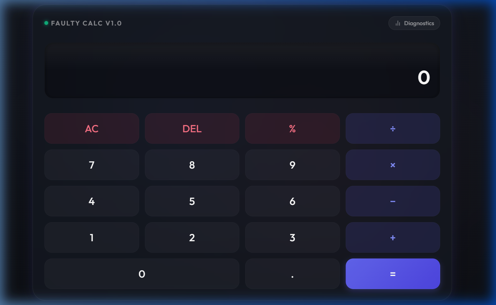
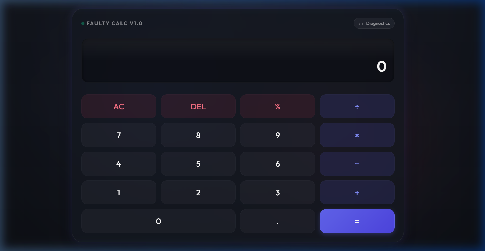
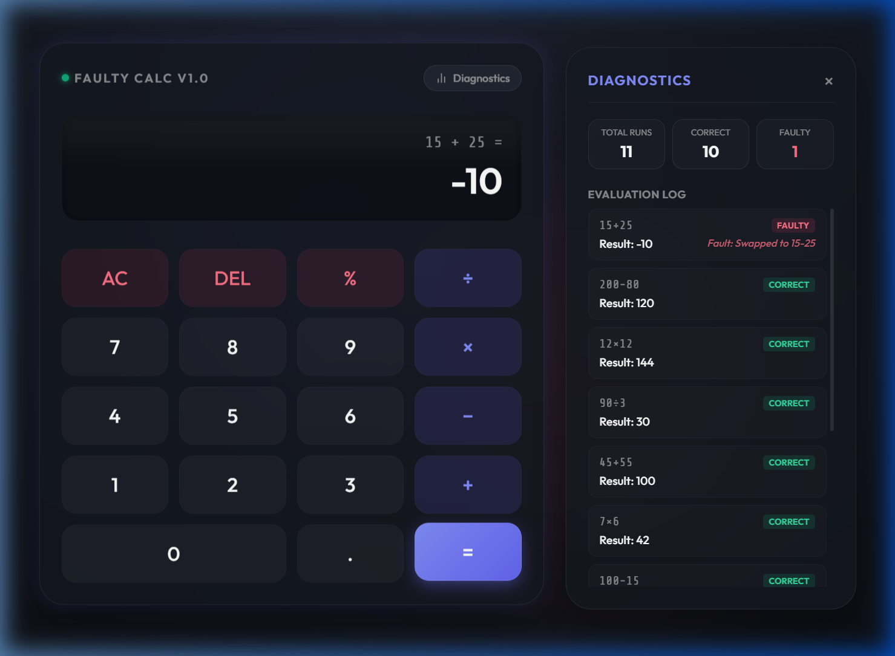

# 🔮 Quantum Faulty Calculator

A premium, interactive web-based calculator featuring a modern **glassmorphic design**, smooth **micro-animations**, complete **keyboard shortcuts**, and a **dynamic diagnostics drawer** that logs evaluations.

As a twist, this calculator is **faulty**: statistically, **10% of calculations** (roughly once in ten inputs) will fail to give the correct answer by swapping mathematical operators.

---

## 📸 Walkthrough & Screenshots

### 1. Modern Glassmorphic Design
The interface is designed with harmonized HSL colors, frosted-glass effects, and modern Outfit typography.


### 2. Side Diagnostics Drawer
A slide-out drawer displays live statistics (Total Evaluated, Correct Runs, Faulty Runs) and records a historical list of all calculation actions.


### 3. Operator Swapping (The "Fault" Logic)
When a faulty run triggers, the screen performs a **visual glitch/flicker animation**, and the drawer documents the exact math swap that occurred behind the scenes (e.g., swapping addition with subtraction, or multiplication with division).


---

## ⚡ Features

- **High-End UI/UX**: Built using clean HSL color systems, glassmorphism (`backdrop-filter`), glowing borders, and interactive transitions.
- **Physical Key Feedback**: Buttons scale down slightly (`scale(0.94)`) when pressed, mimicking a physical tactile click.
- **10% Error Rate**: Statistically, 1 in 10 evaluations triggers a faulty output.
- **Visual Error Indicator**: The display screen glitches/flickers when a faulty calculation is generated.
- **Diagnostics Drawer**: Tracks overall stats and shows the exact operators that were swapped.
- **Keyboard Support**: Full numeric keyboard support including Numpad, operators (`+`, `-`, `*`, `/`), `Backspace` (DEL), `Escape` (AC), and `Enter` (`=`).

---

## 🛠️ How It Works (The Code)

When you hit the equals (`=`) button:
1. The app generates a random decimal.
2. If `Math.random() < 0.10` evaluates to true (10% probability), a fault is triggered.
3. The calculation operators are simultaneously swapped using a regex mapping:
   - `+` becomes `-` (and vice-versa)
   - `*` becomes `/` (and vice-versa)
4. For example, if you enter `15 + 25` and the fault triggers, the calculator swaps the operator to evaluate `15 - 25`, resulting in `-10`.
5. The original expression and the faulty math details are updated in the logs.

---

## 🚀 Getting Started

1. Clone this repository:
   ```bash
   git clone https://github.com/hwsinha/Faulty-Calculator.git
   ```
2. Open the directory:
   ```bash
   cd "Faulty-Calculator"
   ```
3. Open `index.html` directly in any web browser, or spin up a local server:
   ```bash
   npx http-server -p 8081
   ```
4. Navigate to `http://localhost:8081` in your browser.
